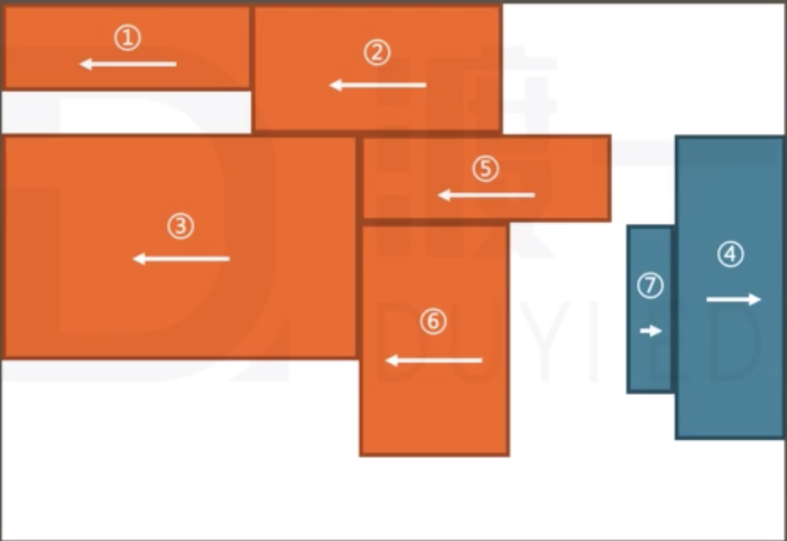

# 浮动流 {ignore}

[toc]


## 视觉格式化模型 (布局规则)
页面中多个盒子的排列规则

大体上将页面中盒子的排列分为三种方式：

1. 常规流
2. 浮动
3. 定位

## 浮动应用场景
1. 文字环绕
2. 横向排列

## 浮动基本特点

```css
.f {
  /* 默认值不浮动 */
  float: none;
  /* 向上向左浮动 */
  float: left;
  /* 向上向右浮动 */
  float: right;
}
```

1. 一个元素浮动后，元素会强制更改diaplay属性为block
2. 浮动元素的包含块和常规流一样，为父元素的内容盒

## 盒子尺寸：
1. 宽度为auto时，适应内容宽度
2. 高度为auto时，与常规流一致，适应内容高度
3. margin 为 auto 时，取值为 0
4. 边框、内边距，百分比设置与常规流一致

## 盒子排列
1. 左浮动的盒子向上向左排列
2. 右浮动的盒子向上向右排列
3. 浮动盒子在包含块中排列时，会避开常规流盒子
4. 常规流块盒在排列时，无视浮动盒子
5. 行盒在排列时，会避开浮动盒子

> 如果文字没有在行盒中，浏览器会自动生成一个行盒包裹文字，叫做匿名行盒。

## 高度坍塌
高度坍塌的原因：
常规流盒子的自动高度，在计算时，不会考虑浮动盒子

解决方式：
清除浮动
```css
.clearfix {
  /* 默认值 不清除浮动 */
  clear: none;
  /* 清除左浮动，该元素必须出现在前面所有左浮动盒子的下方 */
  clear: left;
  /* 清除右浮动，该元素必须出现在前面所有右浮动盒子的下方 */
  clear: right;
  /* 清除左、右浮动，该元素必须出现在前面所有浮动盒子的下方 */
  clear: both;
}

.clearfix::after {
  content: "";
  display: block;
  clear: both;
}
```

> * 带有行盒特性的盒子不能使清除浮动的属性"clear"生效
> * 可以使clear属性生效的盒子有block、table、flex、grid等

## 浮动的细节规则
> 1. 左浮动的盒子向上向左排列
> 2. 右浮动的盒子向上向右排列
> 3. 浮动盒子的顶边不得高于上一个盒子的顶边
> 4. 若剩余空间无法放下浮动盒子，则该盒子向下移动，直到具备足够的空间能容纳盒子，然后再向左或向右移动

