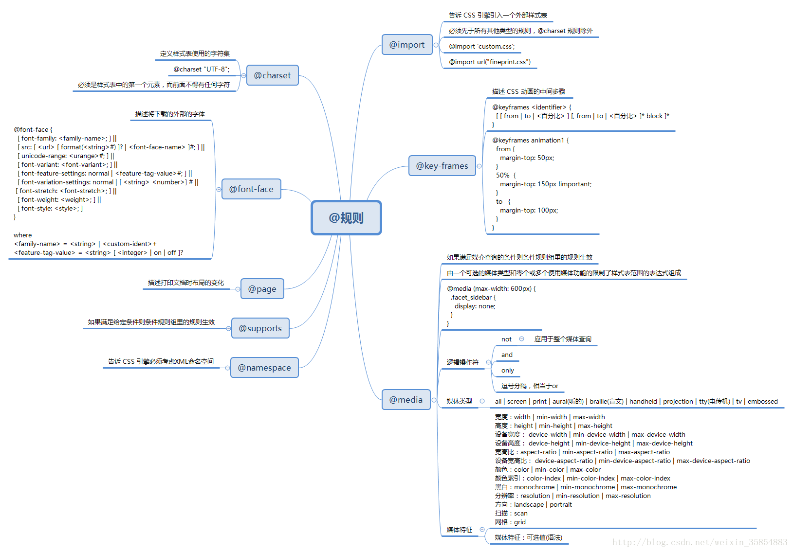

# @规则 {ignore}

[toc]

又叫：@语句、css语句、css指令

1. @charset "utf-8";
> 这个指令必须写在第一行, 而且前面不能有任何字符
> 告诉浏览器该css文件, 使用的字符编码集是utf-8

2. @import "路径";
> 导入另一个css文件

3. @font-face
描述将下载的外部的字体
4. @media
如果满足媒介查询的条件则条件规则组里的条件生效
5. @key-frames
描述css动画的中间步骤
6. @page
描述打印文档时布局的变化
7. @supports
如果满足给定条件，则条件规则组里的规则生效
8. @namespace
告诉css引擎必须考虑XML命名空间