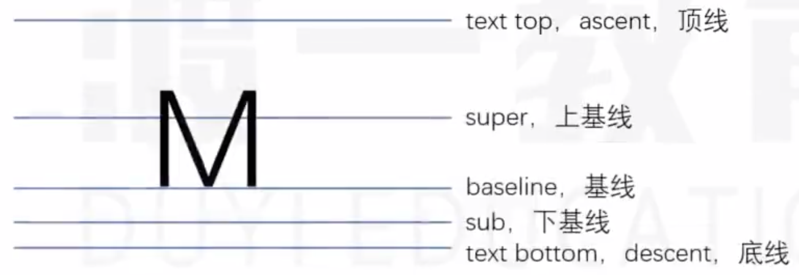
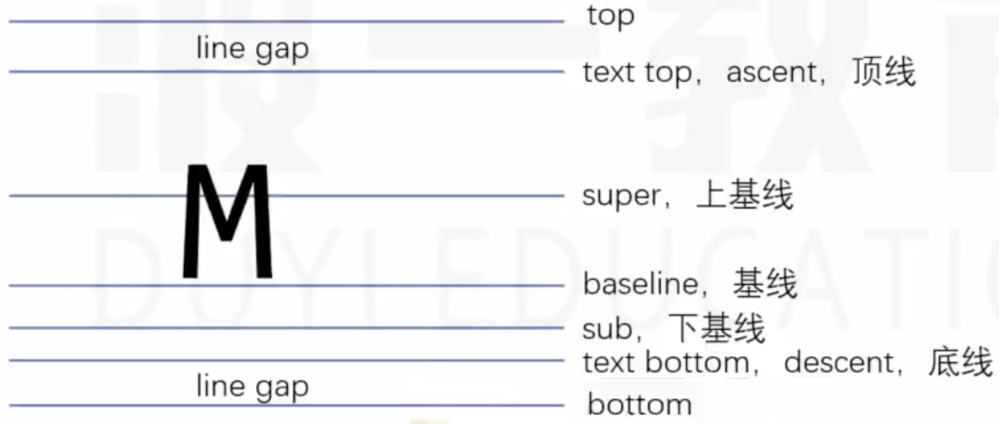

# 深入理解字体 {ignore}

[toc]

font-size
line-height
vertical-align
font-family

## 文字
文字是通过一些文字制作软件制作的，比如fontforge

制作文字时，会有几根参考线。
不同的文字类型，参考线不一样，同一种文字类型，参考线一致。



文字顶线到底线的距离，是文字的实际大小(content-area, 内容区)
> * **行盒的背景覆盖内容区**

## font-size 字体大小

设置的是字体的相对大小

文字的相对大小(em size,字体软件中的参数)： 1000 、 2048 、 1024

以consola字体为例:
在windows系统中，字体的相对大小是2048，它的顶线到底线的距离有2398。
在Mac系统中，字体的相对大小是2048，它的顶线到底线的距离有2048。

所以一个字体**实际占据的空间**一般会比设置的字体尺寸要**大**一些

## line-height 行高

顶线向上延伸的空间，和底线向下延伸的空间，两个空间相等，该空间叫 line gap（空隙）

line gap 默认情况下，是字体设计者决定的。



top 到 bottom，叫做 virtual-area，虚拟区

> 行高就是virtual-area 中间的距离

```css
/* 默认值,使用文字默认的gap,
字体的设计者在设计时会做适当的考虑，
所以如果没有其他的特殊需求，使用 normal 是比较可取的方式 */
line-height: normal;

/* 行高设置为与字体大小相同是不太可取的，
因为一般文字实际占据的空间会比字体尺寸大一些(以windows为准)，
这样设置的行高可能会导致 line gap 值为负数，
容易导致多行文字的覆盖现象，或者行盒的重叠现象，
在字体设置较大时尤为明显 */
line-height: 1;
```

> 文字一定出现在一行的最中间---错误
> content-area 一定出现在 virtual-area 的中间

## vertical-align 文本对齐

> 影响参考线的三个属性: font-family、font-size、line-height

> **一个元素，如果其子元素中存在行盒，该元素内部也会产生参考线**

```css
/* 默认值,该元素的基线，对齐父元素的基线 */
vertical-align: baseline;
/* 该元素的基线，对齐父元素的上基线 */
vertical-align: super;
/* 该元素的基线，对齐父元素的下基线 */
vertical-align: sub;
/* 该元素的 virtual-area 的顶边，对齐父元素的text-top */
vertical-align: text-top;
/* 该元素的 virtual-area 的底边，对齐父元素的text-bottom */
vertical-align: text-bottom;
/* 该元素的 virtual-area 的顶边，对齐父元素 line-box 的顶边*/
vertical-align: top;
/* 该元素的 virtual-area 的底边，对齐父元素 line-box 的底边*/
vertical-align: bottom;
/* 数值: 是相对于基线的偏移量，正负数 */
vertical-align: 2px;
/* 百分比: 相对于基线的偏移量，相对于自身 virtual-area 的高度 */
vertical-align: 30%;
/* 该元素的中线(content-area 的一半)，与父元素的x字母高度一半的位置对齐 */
vertical-align: middle;
```

> 行盒组合起来，可以形成多行，每一行的区域叫做 line-box (这里不是指行盒inline-box), line-box 的顶边是该行内所有行盒最高顶边，底边是该行内所有行盒最低底边。

> 实际，一个元素的实际占用高度（高度自动的情况下），高度的计算通过 line-box 计算。

> line-box 是承载文字内容的必要条件，以下情况不生成 line-box:
> 1. 某元素内部没有任何行盒
> 2. 某元素字体大小为0

## 可替换元素和行块盒

> 官方文档: For elements that do not have a baseline, the bottom margin edge is used instead.
> 翻译: 没有基线的元素，使用外边距的下边缘替代。

> **图片元素**基线位置在图片的下外边距

由于图片的下外边距与父元素的基线对齐，必然会产生空白。

表单元素：基线位置在内容底边

行块盒：
1. 行块盒最后一行有 line-box，用最后一行的基线作为整个行块盒的基线。
2. 如果行块盒最后一行没有 line-box，用下外边距作为基线。